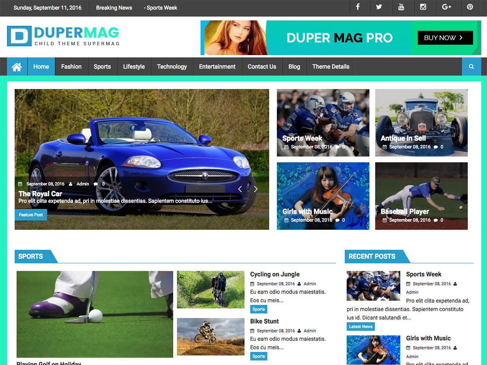

# DuperMag

**Contributors:** acmethemes  
**Requires at least:** 6.6  
**Tested up to:** 7.0  
**Requires PHP:** 7.4  
**Stable tag:** 4.0.0  
**License:** GPLv2 or later  
**License URI:** https://www.gnu.org/licenses/gpl-2.0.html  

> 

DuperMag is a child theme of [SuperMag](https://wordpress.org/themes/supermag/), extending its parent with a bolder visual style — full-width images on blog and single posts, redesigned social sections, a reimagined menu, and improved widget styling. It inherits all of SuperMag's powerful magazine features while adding its own distinctive look.

> **Note:** DuperMag requires [SuperMag](https://wordpress.org/themes/supermag/) to be installed and activated first.

## Features

- **Full-width blog images** — larger, more impactful post thumbnails
- **Full-width single post images** — immersive reading experience
- **Redesigned menu** — cleaner navigation with integrated search
- **Enhanced social section** — prominent social media display
- **Custom widget styles** — purpose-built for magazine layouts
- **Improved featured section** — category selection for right-side content
- **Recent news section** — dedicated area for latest headlines

All features of **SuperMag** are also available, including:
- Breaking news ticker, advertisement ready, drag-and-drop widgets, advanced layout options, and more.

## Installation

1. First, install and activate [SuperMag](https://wordpress.org/themes/supermag/).
2. Download the DuperMag theme zip file.
3. In your WordPress admin, go to **Appearance → Themes**.
4. Click **Add New** → **Upload Theme**.
5. Select the zip file and click **Install Now**.
6. Click **Activate**.

## Frequently Asked Questions

### What are the main differences from SuperMag?

DuperMag adds full-width archive and single-post images, redesigned menus with search, updated widget styles, a recent news section, and a reworked featured section with category selection.

### Do I need SuperMag installed?

Yes. DuperMag is a child theme and requires the SuperMag parent theme.

## Credits

DuperMag is a child theme of [SuperMag](https://wordpress.org/themes/supermag/) and is licensed under GPLv2 or later. It uses the same third-party resources as its parent theme.

---

[Demo](http://www.demo.acmethemes.com/dupermag/) &middot; [Support](https://www.acmethemes.com/supports/) &middot; [Acme Themes](https://www.acmethemes.com)
